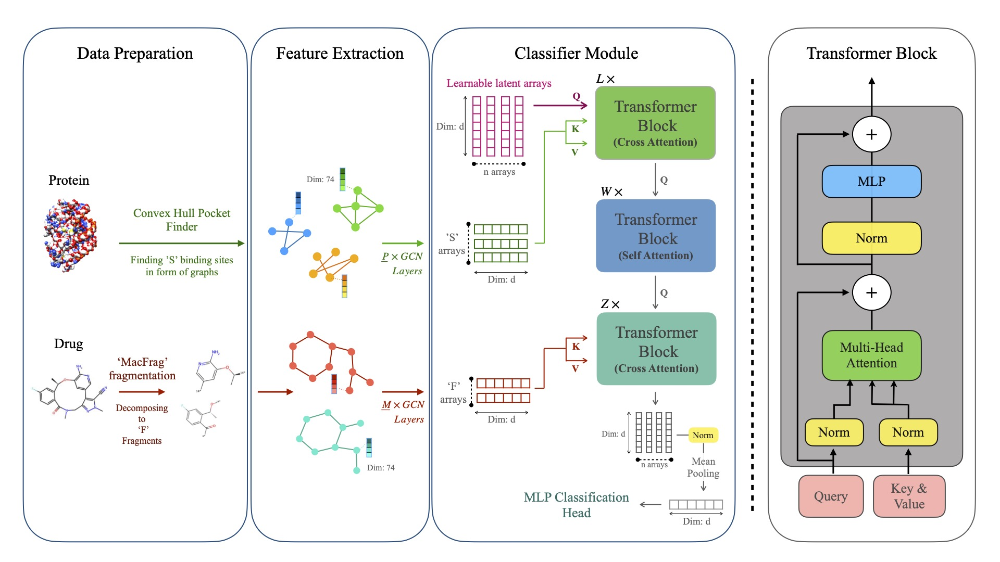

# 🚀 Exciting News! 🧬 
Introducing DeepDrugDomain: A cutting-edge toolkit for Drug-Target Interaction & Affinity Prediction. Streamlined preprocessing, advanced modeling capabilities, and more - all in one comprehensive library. Revolutionize your DTI and DTA research with #DeepDrugDomain! Check it out now: [Github](https://github.com/yazdanimehdi/DeepDrugDomain) #Bioinformatics #MachineLearning #DrugDiscovery

# Exciting News Ahead!

:sparkles: **Coming Soon**: We are thrilled to announce that a new project, the [DeepDrugDomain Package](https://github.com/yazdanimehdi/deepdrugdomain), is in the works! While this current repository has served us well, we're gearing up for an exciting transition to a more advanced and feature-rich package.

The DeepDrugDomain Package will offer enhanced capabilities for drug-target interaction and affinity prediction, integrating the latest advancements in the field. Although the repository is not public yet, we're just putting on the finishing touches.

Keep an eye on this page for future updates and the big reveal!

Thank you for your interest and support!

# FragXSiteDTI

This is The repository for supporting matterial of [FragXsiteDTI: Revealing Responsible Segments in Drug-Target Interaction with Transformer-Driven Interpretation](https://arxiv.org/abs/2311.02326) (Neurips AI4D3 Workshop 2023).


## Requirements
A suitable [conda](https://conda.io/) environment can be created:
```
conda create --name fragx python=3.11
conda activate fragx
conda install -c conda-forge rdkit
pip install -r requirements.txt

```
# Cite
If you find this repo to be useful or if you use Datasets with 3D structures included, please cite our papers. Thank you.

FragXsiteDTI:
```
@article{yalabadi2023fragxsitedti,
  title={FragXsiteDTI: Revealing Responsible Segments in Drug-Target Interaction with Transformer-Driven Interpretation},
  author={Yalabadi, Ali Khodabandeh and Yazdani-Jahromi, Mehdi and Yousefi, Niloofar and Tayebi, Aida and Abdidizaji, Sina and Garibay, Ozlem Ozmen},
  journal={arXiv preprint arXiv:2311.02326},
  year={2023}
}
```

AttentionSiteDTI:
```
@article{yazdani2022attentionsitedti,
  title={AttentionSiteDTI: an interpretable graph-based model for drug-target interaction prediction using NLP sentence-level relation classification},
  author={Yazdani-Jahromi, Mehdi and Yousefi, Niloofar and Tayebi, Aida and Kolanthai, Elayaraja and Neal, Craig J and Seal, Sudipta and Garibay, Ozlem Ozmen},
  journal={Briefings in Bioinformatics},
  volume={23},
  number={4},
  pages={bbac272},
  year={2022},
  publisher={Oxford University Press}
}
```
